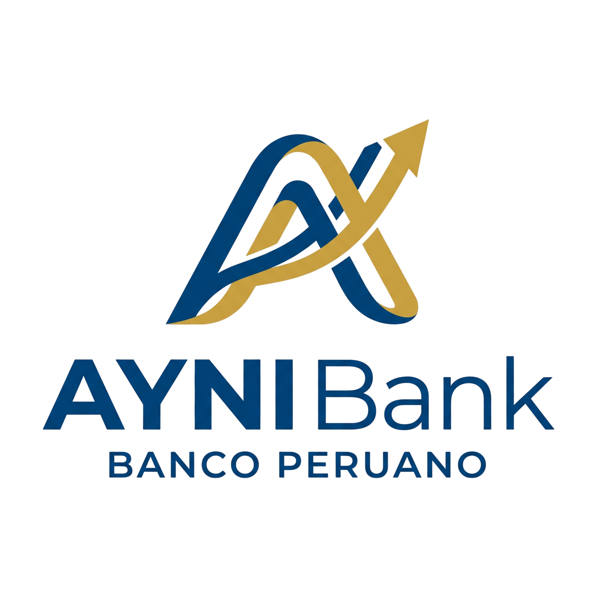
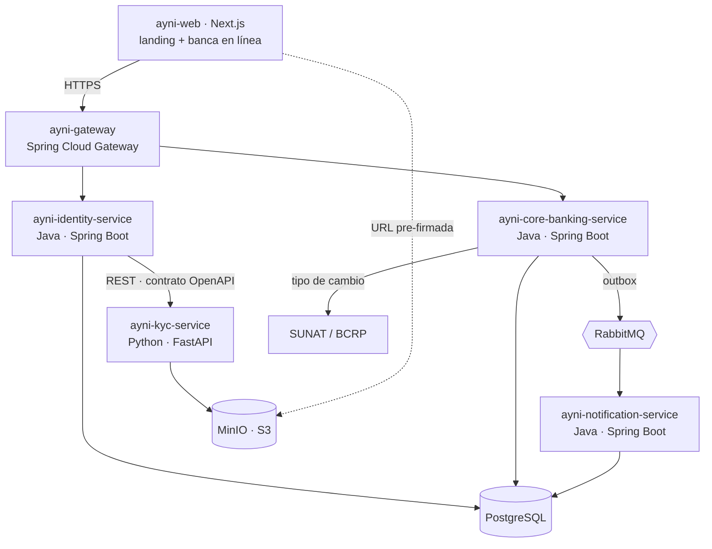

<div align="center">



### Banca 100% digital · Hoy por ti, mañana por mí

[](https://github.com/LOAD-13/ayni-bank/actions/workflows/ci.yml)
[](https://sonarcloud.io)
[](#calidad)
[](docs/arquitectura/diseno-base.md)
[](#calidad)
[](SECURITY.md)
[](LICENSE)

</div>

---

## Qué es Ayni Bank

**Ayni Bank** es un banco 100% digital para personas naturales en Perú. Sin agencias, sin cajeros
propios y sin comisión de mantenimiento. Se abre una cuenta en minutos desde el navegador con el
DNI y una selfie, el saldo rinde intereses **todos los días**, y la tarjeta se controla íntegramente
desde la web.

El nombre viene del principio andino de reciprocidad **ayni** — *hoy por ti, mañana por mí*. Un
banco sin comisiones, donde el dinero de la comunidad rinde para la comunidad, es literalmente ayni.

### El problema que resuelve

| Situación actual en Perú | Qué hace Ayni |
|---|---|
| Abrir una cuenta exige ir a una agencia en horario bancario | Onboarding completo desde el navegador en **menos de 90 segundos** |
| Las cuentas de ahorro rinden en torno al **0.5% TREA**, por debajo de la inflación | Cuenta remunerada con **devengo diario** y TREA publicada de forma transparente |
| La comisión de mantenimiento penaliza proporcionalmente más a los saldos pequeños | **Cero comisión de mantenimiento**, por lo que TREA = TEA |
| La verificación de identidad es manual y sin trazabilidad | KYC con OCR del DNI, prueba de vivacidad y cotejo biométrico, **todo auditado** |

---

## Funcionalidades

**Identidad y acceso** — Registro, autenticación con segundo factor TOTP, tokens de acceso de vida
corta con refresh rotativo, bloqueo progresivo ante intentos fallidos.

**Onboarding KYC** — Captura del DNI por ambas caras con detección automática de que el documento
*es* un DNI, extracción de datos por OCR, selfie con prueba de vivacidad y cotejo facial contra la
foto del documento. Consentimiento informado conforme a la Ley N.º 29733.

**Cuentas** — Cuenta de ahorro remunerada en soles y en dólares. Interés devengado cada día sobre el
saldo de cierre, capitalizado mensualmente. **Libro mayor de doble partida**: el saldo no es un
campo mutable, es la suma de sus asientos.

**Tarjeta de débito virtual** — Emisión instantánea, congelamiento inmediato, límite diario de
consumo, control de compras por internet. El PAN se cifra en reposo y el CVV nunca se almacena.

**Transferencias** — Entre cuentas Ayni e interbancarias por CCI, con **idempotencia obligatoria**
para que un doble clic jamás mueva el dinero dos veces.

**Multimoneda** — Conversión con tipo de cambio consultado a la fuente oficial **SUNAT/BCRP**,
registrando siempre el tipo aplicado y su timestamp para poder auditar cualquier operación pasada.

**Operación** — Back-office con **segregación de funciones** y principio de cuatro ojos: quien
inicia una operación sensible no puede aprobarla. Pista de auditoría inalterable.

---

## Arquitectura



Cinco servicios más la aplicación web. **Cada servicio es hexagonal por dentro**: el dominio al
centro sin conocer Spring, JPA ni HTTP, y los adaptadores enchufados en los bordes.

Dos decisiones que definen el sistema:

**El dinero viaja junto.** Cuentas, asientos contables y transferencias comparten el mismo límite
transaccional dentro de `core-banking-service`. Separarlos convertiría una transferencia en una
saga distribuida con compensaciones — la principal fuente de dinero duplicado o perdido en sistemas
financieros reales.

**Las notificaciones van por outbox.** El evento se escribe en la base de datos dentro del **mismo
COMMIT** que mueve el dinero. Si la transferencia hace rollback, nunca se notifica algo que no
ocurrió; si el broker está caído, el evento espera en la tabla y se publica al restablecerse.

📐 Detalle completo en [`docs/arquitectura/diseno-base.md`](docs/arquitectura/diseno-base.md) ·
Decisiones razonadas en [`docs/arquitectura/adr/`](docs/arquitectura/adr/)

---

## Stack

| Capa | Tecnología |
|---|---|
| Back-end | Java 21 · Spring Boot 3 · Spring Security · Spring Cloud Gateway |
| Visión por computadora | Python 3.12 · FastAPI · OpenCV · PaddleOCR |
| Front-end | Next.js · React · TypeScript · Tailwind |
| Persistencia | PostgreSQL 16 · Flyway · Hibernate Envers |
| Almacenamiento de objetos | MinIO (compatible con S3) |
| Mensajería | RabbitMQ |
| Resiliencia | Resilience4j (timeout · retry · circuit breaker) |
| Pruebas | JUnit 5 · AssertJ · Testcontainers · ArchUnit · Cucumber · Playwright · k6 · PIT |
| Calidad | SonarCloud · JaCoCo · Spotless · Checkstyle |
| Seguridad | Gitleaks · Trivy · OWASP Dependency-Check · OWASP ZAP |
| Observabilidad | Prometheus · Grafana · Loki |
| Entrega | Docker · GitHub Actions · GHCR (multi-arquitectura `linux/arm64`) |

---

## Cómo levantarlo

> **Estado actual — Sprint 0 (17 – 23 ago 2026).** La fundación del repositorio, la infraestructura
> y los pipelines están definidos. El andamiaje de los cinco servicios está en curso
> (`AYNI-38`), por lo que `docker compose up` todavía no levanta la aplicación completa: sí
> levanta PostgreSQL, RabbitMQ, MinIO y la observabilidad. Este bloque describe el
> procedimiento definitivo, operativo al cierre del Sprint 0.

**Requisitos:** solo Docker y Git. Nada más.

```bash
git clone https://github.com/LOAD-13/ayni-bank.git
cd ayni-bank
cp .env.example .env
docker compose -f infra/docker/docker-compose.yml up -d
```

Las migraciones de Flyway se aplican solas al arrancar y se cargan datos de prueba.

| Servicio | URL |
|---|---|
| Aplicación web | http://localhost:3000 |
| API Gateway | http://localhost:8080 |
| Documentación de la API | http://localhost:8080/swagger-ui.html |
| Consola de MinIO | http://localhost:9001 |
| Panel de RabbitMQ | http://localhost:15672 |
| Grafana | http://localhost:3001 |

Para detener y limpiar:

```bash
docker compose -f infra/docker/docker-compose.yml down -v
```

---

## Estructura del repositorio

```
ayni-bank/
├── services/
│   ├── ayni-gateway/                 enrutado, rate limiting, validación de JWT
│   ├── ayni-identity-service/        registro, autenticación, MFA, onboarding
│   ├── ayni-core-banking-service/    cuentas, ledger, tarjetas, transferencias
│   ├── ayni-notification-service/    correo y notificaciones por eventos
│   └── ayni-kyc-service/             OCR, vivacidad y cotejo facial (Python)
├── web/ayni-web/                     landing pública y banca en línea
├── contracts/                        OpenAPI — fuente de verdad de las APIs
├── infra/
│   ├── docker/                       compose de desarrollo, staging y producción
│   └── observability/                Prometheus, Grafana, Loki
├── docs/
│   ├── gestion/                      cronograma y planificación
│   ├── arquitectura/                 diseño base, C4, EER, ADRs
│   ├── calidad/                      SLA, plan de pruebas, ISO 25010
│   └── marca/                        sistema de diseño
└── assets/                           logotipo, isotipo e imágenes
```

---

## Calidad

Nada se declara cumplido sin medición. Cada Pull Request ejecuta:

| Verificación | Herramienta | Umbral |
|---|---|---|
| Pruebas de dominio | JUnit 5, sin Spring | 100% en verde |
| **Arquitectura hexagonal** | **ArchUnit** | `domain` no importa Spring, JPA ni `infrastructure` |
| Integración | Testcontainers (Postgres, RabbitMQ, MinIO reales) | 100% en verde |
| Contrato Java ↔ Python | OpenAPI + cliente generado | build falla si divergen |
| Criterios de aceptación | Cucumber (los escenarios DADO/CUANDO/ENTONCES) | 100% en verde |
| Cobertura | JaCoCo | ≥ 80% en el dominio |
| Análisis estático | SonarCloud | quality gate superado |
| Secretos | Gitleaks | cero hallazgos |
| Vulnerabilidades | Trivy · OWASP Dependency-Check | cero críticas o altas |
| Mutación | PIT | semanal |
| Accesibilidad | axe-core | WCAG 2.1 AA |
| Carga | k6 | p95 < 500 ms |

> **Sobre la cobertura:** no la tratamos como métrica de calidad. Se puede tener 90% de cobertura
> con pruebas que no verifican nada. Por eso corremos **pruebas de mutación con PIT**, que alteran
> el código a propósito y comprueban si alguna prueba se rompe.

### Niveles de servicio comprometidos

| Indicador | Objetivo |
|---|---|
| Disponibilidad mensual | 99.5% |
| Latencia de API | p95 < 500 ms · p99 < 1 s |
| Onboarding KYC completo | < 90 s |
| Transferencia interna | < 3 s |
| Tasa de error | < 0.1% |
| RPO / RTO | 24 h / 4 h |

---

## Seguridad

Contraseñas con **Argon2id**. Tokens de acceso de 15 minutos con **refresh rotativo** — reutilizar
un refresh delata el robo e invalida toda la familia. **MFA por TOTP** en operaciones sensibles.
Cifrado **AES-256-GCM** en reposo para PAN, documento de identidad y semilla TOTP. Pista de
auditoría **append-only**, con `UPDATE` y `DELETE` revocados a nivel de PostgreSQL.

Marcos aplicados: **OWASP ASVS nivel 2**, **OWASP Top 10**, **ISO/IEC 27001 Anexo A** y la
**Ley N.º 29733** de Protección de Datos Personales del Perú — que clasifica los datos biométricos
como sensibles y exige consentimiento explícito.

🔐 Detalle en [`SECURITY.md`](SECURITY.md)

---

## Cómo contribuir

Trabajamos con **GitFlow** y **Conventional Commits**. Una rama por Historia de Usuario, nombrada
con su clave de Jira:

```bash
git switch develop && git pull
git switch -c feature/AYNI-42-registro-de-usuario
# ... trabajar ...
git commit -m "feat(identity): validar política de contraseñas en el registro"
git push -u origin feature/AYNI-42-registro-de-usuario
```

`main` y `develop` están protegidas: sin push directo, Pull Request con al menos una aprobación y
todos los checks en verde.

📋 Guía completa en [`CONTRIBUTING.md`](CONTRIBUTING.md) ·
Convenciones de código en [`CODESTYLE.md`](CODESTYLE.md) ·
Criterio de terminado en [`DEFINITION_OF_DONE.md`](DEFINITION_OF_DONE.md)

---

## Equipo

| Integrante | Rol |
|---|---|
| **Joaquín Alfonso Loa Denegri** | Jefe de Proyecto · Product Owner · Developer |
| **Kiara Moshell Santti Saavedra** | Scrum Master · Developer |
| **Gerardo Raúl Socualaya Mandamiento** | Developer |
| **Eduardo Vargas Zumaeta** | Developer |

Proyecto del curso **Integrador II: Software** — Ingeniería de Software, Universidad Tecnológica del
Perú. Ciclo 2026-2. Docente asesor: Dr. Carlos R. P. Tovar.

---

## Hoja de ruta

Sprint 0 de una semana más ocho sprints de dos semanas, del 14 de agosto al 13 de diciembre de 2026.

🗺️ [`ROADMAP.md`](ROADMAP.md) · [Cronograma](docs/gestion/gantt.mmd)

---

## Aviso

Ayni Bank es un **proyecto académico**. No es una entidad financiera autorizada, no está supervisada
por la Superintendencia de Banca, Seguros y AFP, y no opera con dinero real. Las integraciones con
RENIEC y con la Cámara de Compensación Electrónica son **servicios simulados con contrato
documentado**; la única integración con un sistema externo real es la consulta de tipo de cambio a
SUNAT/BCRP.

---

<div align="center">
<sub>Hecho en Perú 🇵🇪 · <b>Ayni Bank</b> · Licencia MIT</sub>
</div>
