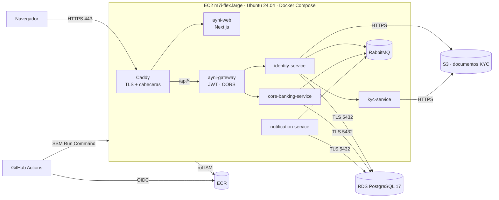

# Manual de despliegue · Ayni Bank en AWS

> Cómo se monta producción desde cero y cómo llega cada versión. La decisión y sus alternativas
> están en [ADR-0026](../arquitectura/adr/0026-produccion-en-aws-con-despliegue-continuo.md).

## 1. Arquitectura desplegada



| Recurso | Nombre | Notas |
|---|---|---|
| Región | `us-east-1` | |
| Instancia | `ayni-bank-prod` | IP elástica, sin SSH. No se enciende sola; se apaga cada día a las 23:00 (Lima) |
| Base de datos | `ayni-bank-prod` | `db.t4g.micro`, 20 GB gp3 cifrados, copia diaria y PITR de 1 día (límite del plan gratuito) |
| Bucket | `ayni-kyc-documentos-<cuenta>` | Privado, cifrado, versionado, solo TLS |
| Registro | `ayni/*` en ECR | 6 repositorios, escaneo al publicar, 10 imágenes por servicio |
| URL | `https://ayni.<ip-con-guiones>.sslip.io` | Certificado de Let's Encrypt emitido por Caddy |

## 2. Requisitos previos

- AWS CLI v2 autenticado con una identidad con permisos de administración (solo para el paso 3).
- `gh` autenticado contra el repositorio.
- Ninguna herramienta en la instancia: la prepara su `UserData` (Docker, Compose, AWS CLI, psql).

## 3. Crear la infraestructura (una sola vez)

```bash
aws cloudformation deploy \
  --stack-name ayni-bank-prod \
  --template-file infra/aws/ayni-bank.cfn.yaml \
  --capabilities CAPABILITY_NAMED_IAM \
  --region us-east-1

aws cloudformation describe-stacks --stack-name ayni-bank-prod \
  --query "Stacks[0].Outputs" --output table
```

Tarda unos 15 minutos, casi todos de RDS. La salida da la URL, el id de la instancia, el *endpoint*
de la base de datos y el ARN del rol de despliegue.

## 4. Cargar los secretos (una sola vez)

Se guardan en Parameter Store como `SecureString`. Ninguno se escribe en el repositorio.

```bash
P=/ayni/prod
aws ssm put-parameter --type SecureString --name $P/jwt-clave            --value "$(openssl rand -base64 48)"
aws ssm put-parameter --type SecureString --name $P/cifrado-clave        --value "$(openssl rand -base64 32)"
aws ssm put-parameter --type SecureString --name $P/db-app-contrasena    --value "$(openssl rand -base64 24 | tr -d '/+=')"
aws ssm put-parameter --type SecureString --name $P/rabbitmq-contrasena  --value "$(openssl rand -base64 24 | tr -d '/+=')"
aws ssm put-parameter --type String       --name $P/db-host              --value "<EndpointBaseDeDatos>"
aws ssm put-parameter --type String       --name $P/db-secreto-admin     --value "<SecretoBaseDeDatos>"
aws ssm put-parameter --type String       --name $P/bucket-kyc           --value "<BucketKyc>"
aws ssm put-parameter --type String       --name $P/correo-tls           --value "<correo del equipo>"
```

Las credenciales maestras de RDS las genera y custodia RDS en Secrets Manager; las del bucket, la
propia plantilla (`ayni/prod/almacen`). El script de despliegue crea en la primera ejecución el
usuario de aplicación `ayni_app`, que es el único que usan los servicios.

## 5. Conectar GitHub (una sola vez)

```bash
gh variable set AWS_ROL_DESPLIEGUE --body "<RolDespliegueArn>"
gh variable set AWS_INSTANCIA      --body "<InstanciaId>"
gh variable set AYNI_URL           --body "<Url>"
```

Son **variables**, no secretos: ninguna da acceso por sí sola. El acceso lo da el rol, y solo a este
repositorio desde `main`.

## 6. Desplegar una versión

No se despliega a mano. El flujo es el de siempre:

1. Rama `feature/AYNI-NN-…` desde `develop` → Pull Request → CI verde → *merge* a `develop`.
2. Pull Request de `develop` a `main` → CI verde → *merge*.
3. El *push* a `main` dispara **CD**: CI completa otra vez, imágenes a ECR, despliegue por SSM,
   pruebas de humo y, si la versión de `VERSION` es nueva, tag `vX.Y.Z` y Release.

Para comprobar a simple vista que llegó: la pantalla de ingreso muestra **«versión vX.Y.Z»**.

## 7. Volver a una versión anterior

- **Automático:** si las pruebas de humo fallan, el job *Revertir* restaura la configuración y las
  imágenes anteriores.
- **Manual:** *Actions → CD → Run workflow*, con la etiqueta (sha corto) de la versión a la que se
  quiere volver. Las 10 últimas imágenes de cada servicio siguen en ECR.

## 8. Operación diaria

| Qué | Cómo |
|---|---|
| Entrar a la instancia | `aws ssm start-session --target <InstanciaId>` |
| Ver los contenedores | `cd /opt/ayni && docker compose -f docker-compose.prod.yml ps` |
| Ver los registros | `docker logs ayni-core-banking-service --since 10m` |
| Salud | `curl https://<url>/api/health` |
| Métricas de la base | Consola RDS → `ayni-bank-prod` → *Monitoring* y *Logs & events* (CloudWatch) |
| Restaurar la base a un instante | Consola RDS → *Restore to point in time* (crea una instancia nueva) |
| Encender fuera de horario | `aws ec2 start-instances --instance-ids <InstanciaId>` |

## 9. Pruebas de humo que corre el pipeline

`infra/scripts/pruebas-humo.sh` comprueba, contra la URL pública:

1. `GET /api/health` responde `UP`.
2. La web responde 200.
3. La pantalla de ingreso muestra la versión recién desplegada.
4. HTTP redirige a HTTPS.
5. Están las cabeceras HSTS, `X-Frame-Options: DENY` y `Content-Security-Policy`, y no se expone `X-Powered-By`.
6. Un inicio de sesión con datos inválidos devuelve **400**, no 200 ni 500.
7. Una ruta protegida sin token devuelve **401**.
